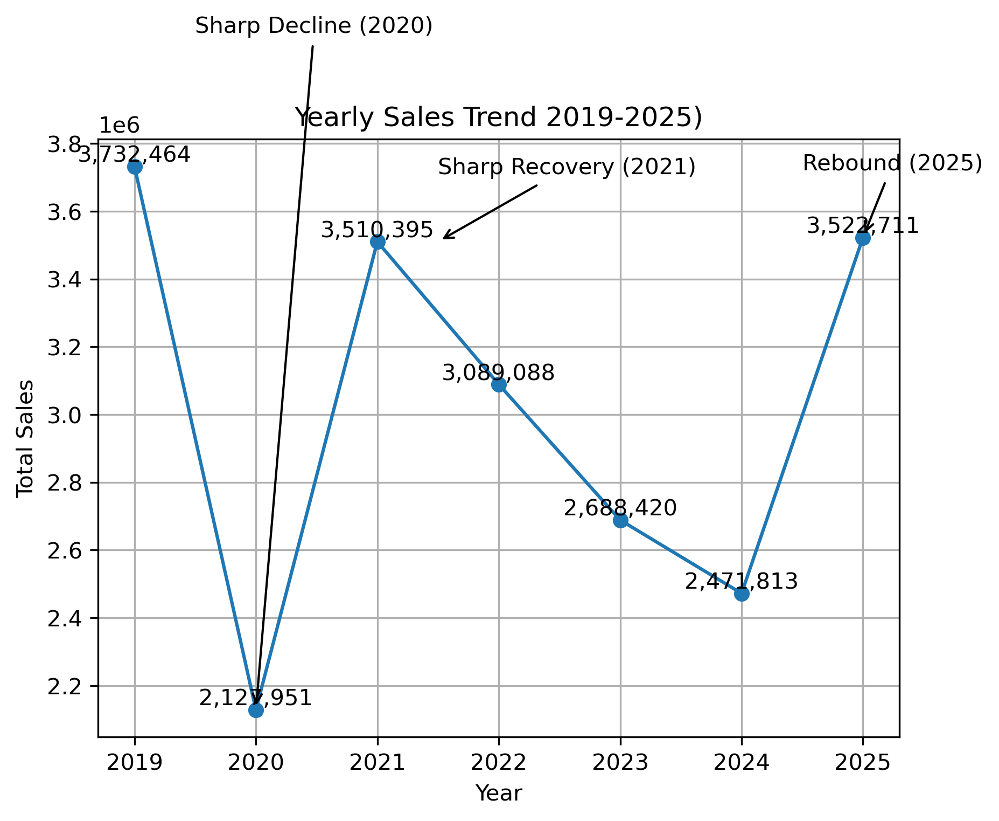

# 📊 Retail Sales Trend Analysis (2019–2025)
## 🔍 Overview
This project analyzes six years of daily retail sales data (2019–2025) to identify trends, disruptions, and recovery patterns over time.

The dataset was cleaned, restructured, and analyzed using Python to produce yearly sales trends and year-over-year performance insights.

---

## 🛠 Tools Used
- Python (Pandas, Matplotlib)
- Jupyter Notebook
- Data Cleaning & Transformation
- Exploratory Data Analysis (EDA)

---  

## 🧹 Data Preparation
The original dataset contained overlapping year-over-year comparisons (e.g., 2019 vs 2020, 2020 vs 2021), which created duplicate records.

To prepare the data for analysis:
- Extracted individual yearly sales values
- Removed duplicate records
- Restructured into a clean time-series format
- Standardized date formatting

---

## 📈 Visualization

## 📊 Key Insights
- Sales were strongest in 2019, representing a stable pre-disruption baseline
- **2020 experienced a sharp decline**, reflecting a major external disruption
- **2021 showed strong recovery**, indicating rebound demand
- **2022–2024 displayed gradual decline**, suggesting normalization after recovery
- **2025 shows renewed growth**, indicating regained momentum
  
---  

## 🌍 Business Context
The data reflects a disruption–recovery–stabilization cycle:
- Pre-disruption (2019)
- Disruption period (2020)
- Recovery phase (2021)
- Post-recovery normalization (2022–2024)
- Growth resurgence (2025)

---

## 📌 Conclusion
This analysis demonstrates how external events can significantly impact retail performance and highlights the importance of trend analysis when evaluating long-term business health.

---

## 📁 Files
- sales_analysis.ipynb → Full analysis notebook
- yearly_sales_trend.png → Final visualization
- 2019_2025_Master.csv → Processed dataset
